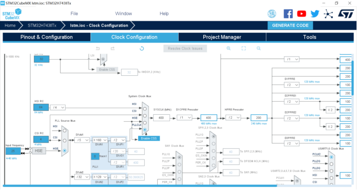
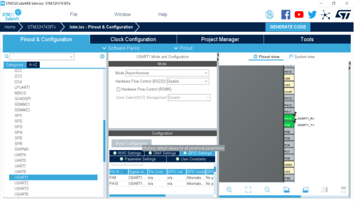
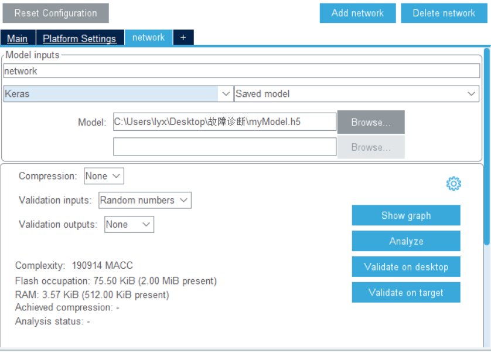
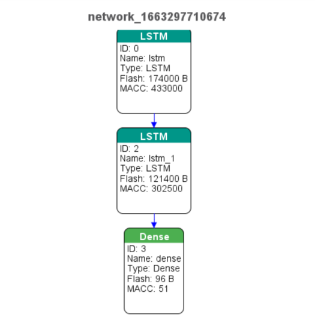
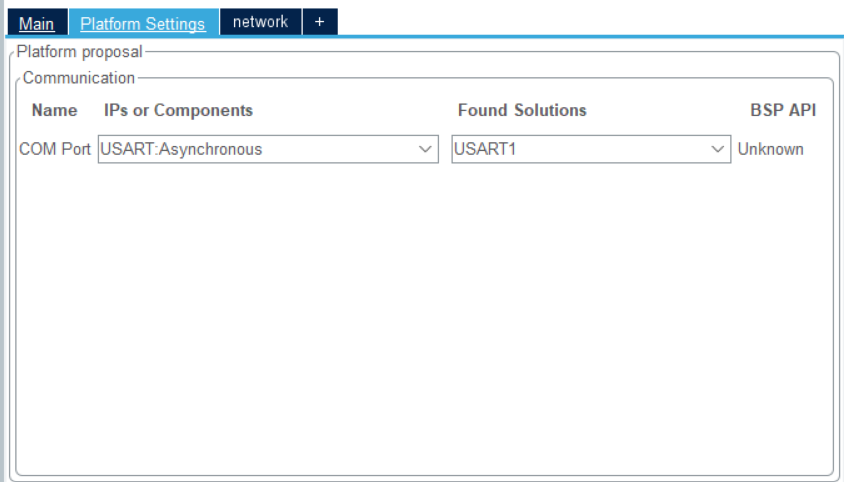
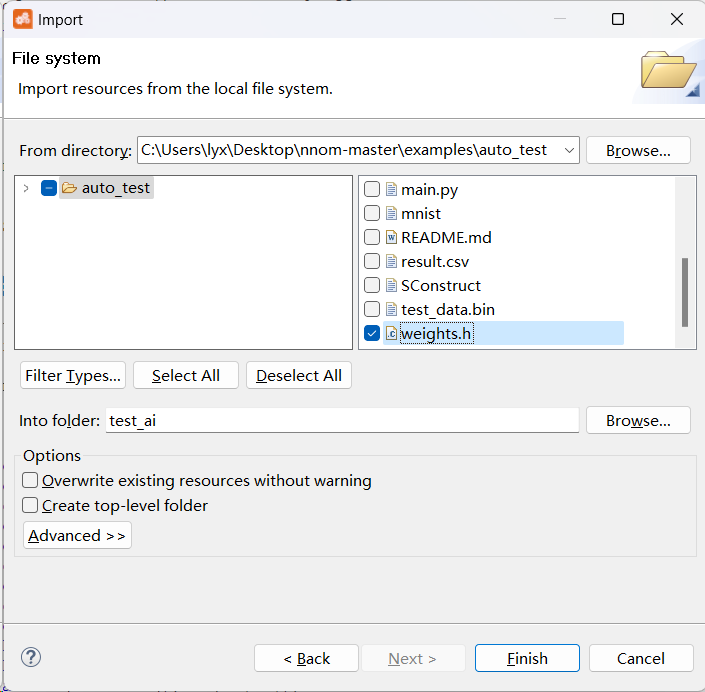
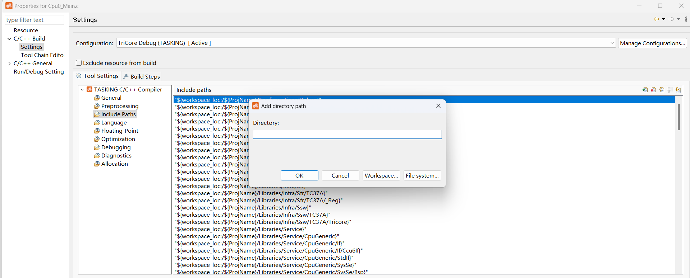
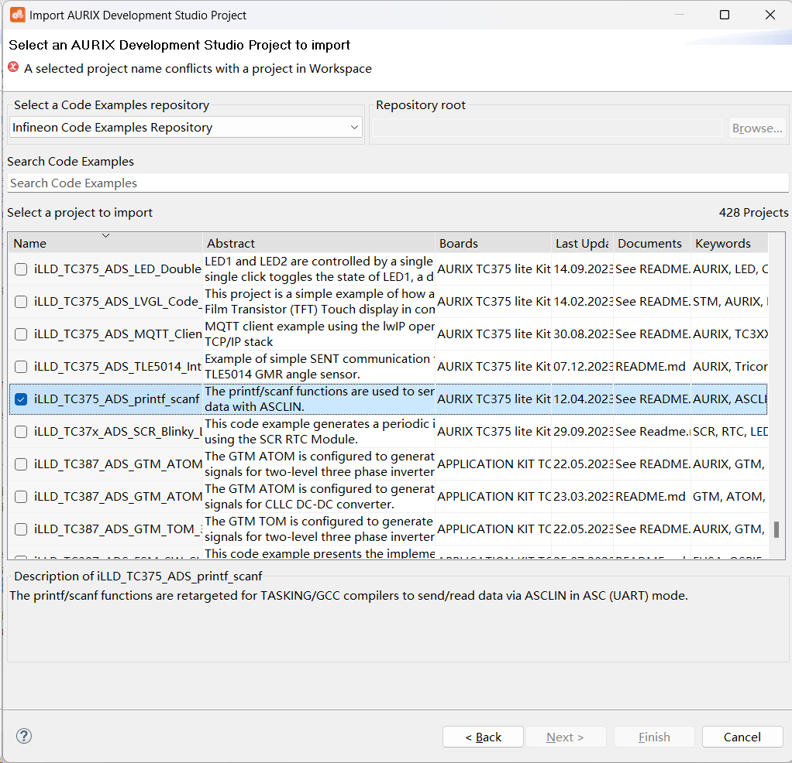
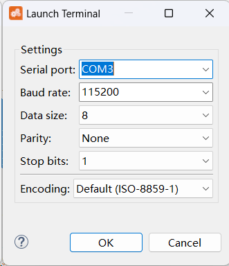

# 嵌入式移植的配置流程
## STM32嵌入式移植的流程
### 获取权重文件
- 通过keras搭建的神经网络可保存为.h5文件  
     `model.save('myModel.h5')`
- 通用型权重文件ONNX  
ONNX(Open Neural Network Exchange)，开放神经网络交换，用 于在各种深度学习训练和推理框架转换的一个中间表示格式。如使用pytorch生产ONNX格式可直接调用  
    `torch.onnx.export(model, input, output_name)`
### 通过cubeMX生成C权重文件
STM32基本配置（以STM32H743为例）
- 时钟树配置
    
- 串口配置  
    设置PA9和PA10引脚分别为UASRT1的RX和TX端，模式选择为异步通信，波特率选择为115200，其余配置选择默认即可。
    
- 网络模型配置和验证  
    在cubeMX中可下载X-CUBE-AI包进行网络模型配置，目前支持的模型有Keras、TFlite和ONNX。  
      
    选择好模型后点击*analyze*，验证通过后可选择*show graph*获取可视化的模型结构
      
    完成模型验证后，开启配置好的串口UASRT1用于传输神经网络的信息  
    
- 生成代码  
点击generate code即可
### C语言编程的重要代码
- 输入和输出缓冲区被定义为具有最多 3 个维度的张量（HWC 布局格式，代表高度、宽度和通道）.  
```
typedef struct ai_buffer_ {
ai_buffer_format format; /*!< 缓冲区格式 */
ai_u16 n_batches; /*!< 缓冲区中的批数 */
ai_u16 height; /*!< 缓冲区高度维度 */
ai_u16 width; /*!< 缓冲区宽度维度 */
ai_u32 channels; /*!< 缓冲区通道编号 */
ai_handle data; /*!< 指向缓冲区数据的指针 */
 } ai_buffer;
```
- 参数定义
``` 
static ai_u8 activations_fe[AI_NETWORK_FE_DATA_ACTIVATIONS_SIZE]; #激活函数数组
static ai_float in_data_fe[AI_NETWORK_FE_IN_1_SIZE]; #输入数据数组
static ai_float out_data_fe[AI_NETWORK_FE_OUT_1_SIZE]; #输出数据数组
static ai_buffer *ai_input_fe;
static ai_buffer *ai_output_fe;
``` 
- ai_init  
用于初始化实例化 NN 的内部运行时结构 
``` 
    int aiInit_fe(void) {
    ai_error err;
    const ai_handle acts[] = { activations_fe };
    err = ai_network_fe_create_and_init(&network, acts, NULL);
    if (err.type != AI_ERROR_NONE) { while(1); };

    ai_input_fe = ai_network_fe_inputs_get(network, NULL);
    ai_output_fe = ai_network_fe_outputs_get(network, NULL);

    return 0;
    }
 ```
- ai_run  
是馈送 NN 的主函数。输入和输出缓冲区参数（ai_buffer 类型）提供输入张量并存储预测的输出张量
``` 
int aiRun_fe(const void *in_data, void *out_data) {
  ai_i32 n_batch;
  ai_error err;
  
  ai_input_fe[0].data = AI_HANDLE_PTR(in_data);
  ai_output_fe[0].data = AI_HANDLE_PTR(out_data);
  n_batch = ai_network_fe_run(network, &ai_input_fe[0], &ai_output_fe[0]);
  if (n_batch != 1) {
      err = ai_network_fe_get_error(network);
  };
	 return 0;
} 
``` 
## 英飞凌平台嵌入式移植的流程
### 获取权重文件  
通过keras搭建的神经网络可保存为.h5文件（目前nnom转换器暂不支持ONNX）
### 使用NNoM转换器将权重文件转换为C文件  
NNoM 是一个定点神经网络库，可以将训练的Keras模型直接转换成C文件。现在支持 8-bit定点格式，支持数十种操作，卷积，池化，激活，矩阵计算等。
- NNoM Utils  
NNoM Utils是用于部署模型的Python脚本。这些函数位于scripts/nnom_utils.py
     - 生成模型  
    `generate_model(model, x_test, name='weights.h', format='hwc', kld=True)`    
    该函数是部署中最常用的功能。它首先使用扫描每层输出的输出范围`layers_output_ranges()`然后量化并写入权重和偏差，使用融合BatchNorm参数`generate_weights()`.最后，生成C函数weights.  
        - model：经过训练的 Keras 模型
        - x_test：用于检查校准每层输出数据量化范围的数据集。**用NNom进行转换时需要提供测试集**
        - name：自动生成的c文件的名称。
        - format：表示后端格式，选项在'hwc'和之间'chw'。参见注释
### 英飞凌平台部署
- 导入NNom相关文件  
将生成的weights.h和其他相关文件(port,inc,src中的文件)导入至aurix development studio中。并将其中所有头文件添加路径到当前工程文件夹。
    - 将已有文件导入工程  
    import->General->File system
    
    - 导入头文件  
    properties->C/C++ builds->settings->include path
    
- c语言相关API
    - `nnom_model_t *new_model(nnom_model_t *m)`  
    用于创建或启动模型
    - `void model_delete(nnom_model_t *m)`  
    用于删除并释放使用模型创建的所有资源。
    - `nnom_status_t   model_run(nnom_model_t *m)`  
    运行模型内的所有层。
    - `nnom_layer_t *model.hook(nnom_layer_t *curr, nnom_layer_t *last);`  
    将两层网络连接在一起
    -nnom_layer_t *model.active(nnom_activation_t *act, nnom_layer_t *target)  
    构建激活函数，合并到目标层
    - `nnom_model_t* nnom_model_create(void)`  
    weight.h文件中的重要函数，其中包含神经网络的层信息。如：
    ```
    static nnom_model_t* nnom_model_create(void)
    {
	static nnom_model_t model;
	nnom_layer_t* layer[16];
	check_model_version(NNOM_MODEL_VERSION);
	new_model(&model);
	layer[0] = input_s(&input_1_config);
	layer[1] = model.hook(conv2d_s(&conv2d_config), layer[0]);
	layer[2] = model.hook(conv2d_s(&conv2d_1_config), layer[1]);
	layer[3] = model.active(act_leaky_relu(0.200000f), layer[2]);
	layer[4] = model.hook(maxpool_s(&max_pooling2d_config), layer[3]);
	layer[5] = model.hook(dw_conv2d_s(&depthwise_conv2d_config), layer[4]);
	layer[6] = model.active(act_adv_relu(0.200000,6.0,0.000000), layer[5]);
	layer[7] = model.hook(conv2d_s(&conv2d_2_config), layer[6]);
	layer[8] = model.active(act_relu(), layer[7]);
	layer[9] = model.hook(maxpool_s(&max_pooling2d_1_config), layer[8]);
	layer[10] = model.hook(flatten_s(&flatten_config), layer[9]);
	layer[11] = model.hook(dense_s(&dense_config), layer[10]);
	layer[12] = model.active(act_relu(), layer[11]);
	layer[13] = model.hook(dense_s(&dense_1_config), layer[12]);
	layer[14] = model.hook(softmax_s(&softmax_config), layer[13]);
	layer[15] = model.hook(output_s(&output0_config), layer[14]);
	model_compile(&model, layer[0], layer[15]);
	return &model;}
    ```
    - 最小程序  
    英飞凌TC37x系列一般有3个CPU，使用其中一个CPU即可，即在CPU0_Main.c进行编程。以下几行代码即可运行神经网络，并在开启串口后打印并传输神经网络的相关信息
    ```
    int main(void)
    {
    nnom_model_t *model;
    model = nnom_model_create();
    model_run(model);
    }
    ```  
#### 串口传输
- 重定向printf和scanf  
nnom中将使用printf传输神经网络的信息，因此需要重定向printf和scanf，官方例程中给出了重定向程序，下面将其中的相关文件加入当前工程。
    - 下载重定向程序  
    打开import->infieon->aurix development studio project，下载工程iLLD_TC375_ADS_printf_scanf  
      
    将该程序中的serialio文件夹按之前的步骤导入到当前工程并添加到路径。
    - 选择串口通信引脚
    ```
    SERIALIO_t SERIALIO =
    {
    .asclin = &MODULE_ASCLIN0,
    .tx_pin = &IfxAsclin0_TX_P14_0_OUT,
    .rx_pin = &IfxAsclin0_RXA_P14_1_IN
    };
    ```
    - 初始化串口  
    `SERIALIO_Init(115200);`
    
- 串口界面  
aurix development studio自带一个串口，打开后选择对应的serial port即可  
